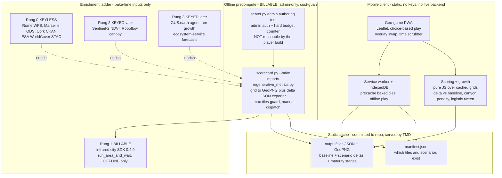

<!-- Generated by the geogame-roadmap multi-agent workflow, 2026-05-29.
     Self-verified against repo files; see docs/API_GUIDE.md for the API onboarding it builds on. -->

# Geo-Game Roadmap — from Microclimate Probe to Tree-Surgeon SimCity

*AT6012 × infrared.city Buildathon 2026 · CCAE / UCC School of Architecture*
*Repo: github.com/ccae-lab/at6012-microclimate-probe (Apache-2.0)*

---

## 1. Vision & the core game tension

We are turning the Regenerative Microclimate Probe into a **tree-surgeon, SimCity-like geo-game**: the player is an urban-forest steward who plants, grows and tends trees on a *real* map and watches *real* microclimate physics respond over simulated years.

The central mechanic is the project's own honest empirical finding, mechanised rather than narrated:

> **Adding trees is NOT automatically regenerative.** Placement, density, species and street geometry decide the outcome. Naive "fill every gap" planting backfires — dense canopy in a narrow street-canyon traps heat at night and kills ventilation/sky-view. Skill = right species, right place, right density.

**This is not a hypothetical — it is what our existing data already says.** Every baked site in `output/kpis.json` shows trees making thermal comfort *worse or neutral*: Marseille heat-stress 79.1% → 83.0%, Rome 96.9% → 97.6%, Cork 0% → 0% (no heat to relieve; only a +7.6% thermal-diversity bump). So the backfire is the **headline, not a risk to manage**. Because the score is always a *delta versus the buildings-only baseline* from `scorecard.py` + `regenerative_metrics.py`, a bad planting returns a negative comfort delta straight from precomputed physics. Failure is the lesson — the CER pedagogy goal, and what makes this a credible research instrument rather than a toy. The honest truth stays visible because it *is* the loss condition, drawn from real data we already hold.

---

## 2. The game in one paragraph (core loop)

One **growing season** = one turn: **Survey → Plant → Tend → Fast-Forward → Read the Verdict → Adapt.** The player surveys a real tile (Leaflet map at `?lat=&lng=&zoom=`, the existing `output/tool.html` URL contract) overlaid with the current hazard (UTCI heat-stress %, ESA WorldCover land-cover, a derived ventilation/sky-view hint). They spend a scarce **Canopy Budget** to choose plantings from a small species deck with honest trade-off cards (crown size, growth rate, evapotranspiration, water need, canyon-fit), and tend (water/prune/fell). They **fast-forward** 5–10 years; trees grow along a logistic curve and the tile snaps to the nearest *pre-baked* microclimate state. A **Verdict card** shows scored deltas (Comfort = ΔUTCI heat-stress, Coherence = ΔTACI, plus a GUS Ecosystem bar when keyed) and *why* — including a "Maladaptive" verdict naming the cause when the delta goes negative. A session is 3–5 seasons, ~6–10 minutes on a phone. **No live billable call ever fires on a tap, because the player build cannot reach the billable backend at all (see §4, §7).**

---

## 3. Architecture overview

The unifying decision across all six lenses: **the scenario, not the tap, is the billable unit.** infrared.city runs happen *offline, in batch, on our schedule* and write a static tile cache; the mobile client only ever *reads* pre-baked scored tiles and runs cheap deterministic scoring/growth math **in the browser as pure functions** — there is no runtime API on the MVP path. The enrichment ladder degrades cleanly, each rung a labelled provider swap honouring FAIR provenance.



**Reading the diagram:** the player's hot path is `PWA → cached tiles + pure-JS scoring` — entirely free, instant, offline-capable, and server-free. The billable path (`server.py → scorecard.py --bake → infrared.city → output/tiles/`) is offline, admin-authenticated, budget-counted, and structurally unreachable from the player build. The static cache is the permanent boundary between the slow/billable world and the instant/free world.

---

## 4. The "API" surface is a file contract, not a server

**Honest reframing: the MVP is file-first, not API-first.** Every capability is a **documented pure function over a static JSON contract**, not a hosted REST endpoint. This is the claim we actually satisfy, and it satisfies the API-first requirement in the form that matters for a static host: stable, documented, machine-readable contracts.

| Capability | Form (MVP) | Contract |
|---|---|---|
| List demo cities + extent | `manifest.json` | `[{city, bbox, zoom, tilesReady}]` |
| Scored tile (the workhorse) | static file | `output/tiles/{z}/{x}/{y}/baseline.json` + `scenarios/*.json` |
| Heatmap overlay | static GeoPNG | one georeferenced single-layer UTCI PNG per state + bounds |
| **Score a chosen planting** (the game-tension engine) | **pure JS function in the browser** | `score(tile, scenario) → {delta, penalties[], regenerative:bool}` over a cached grid — **no HTTP** |
| Growth forecast | pure JS function | logistic tween across baked maturity stages |
| Rung-0 tree register / land-cover | baked into tile JSON at bake time | `{features[], source}` (FAIR-labelled) |

`score()` is where skill is mechanised **in code, not copy**: a dense set on a low-SVF canyon tile returns `regenerative:false` with explicit `penalties` (heat-trapping, lost ventilation) — computed client-side from the cached delta, exactly as `output/kpis.json` already demonstrates for the baked sites.

**A real server appears only when a keyed rung (2/3) actually ships** — Sentinel Hub OAuth, Roboflow, GUS, whose keys must stay server-side. That is Phase 3+ and explicitly **deferred**. The earlier 11-endpoint `/v1/*` REST table, BFF/gateway, and serverless proxy are **cut from the shippable path**: they were scaffolding for rungs the MVP does not reach, and a small architecture-school team would feel obliged to build a platform instead of a submission.

**Cost-guard hole to close now:** the shipped `output/tool.html` exposes a `localhost:8000/run` backend field (line 102) that POSTs (line 234) to billable `run_area_and_wait`. **The game build must strip that live-run field entirely (cache-read only).** `server.py` must additionally sit behind admin auth and a hard server-side budget counter that *actually decrements and refuses* — the `/admin/budget` idea was never enforced in code. CI gating alone is not the guard; the guard is that the player build has no path to a billable call.

---

## 5. Mobile-first experience — all net-new

**Status check, stated plainly: mobile is 0% done.** The one shipped UI, `output/tool.html`, is a **desktop control panel** — a text input for the backend URL, checkboxes, an opacity slider, dropdowns. There is no phone layout, no touch targets, no PWA manifest, no service worker. Everything below is **net-new work**, not a polish pass on `tool.html`. The 44×44px / VoiceOver / `prefers-reduced-motion` items are **targets, not current status.**

**The map is the whole UI.** Bottom-anchored, thumb-zone controls; the map stays uncovered.

**Key screens (to build)**
1. **Map / play view** — full-bleed map, big score HUD ("Comfort 79% → 83% heat-stress — you made this block *worse*"; red when a choice backfired), species/scenario picker dock, time scrubber.
2. **Scenario card (swipe-up sheet)** — species archetype, crown at current sim-year, this choice's contribution, the tension warning when density/SVF is degrading.
3. **Deep metrics sheet** — full `regenerative_metrics.py` breakdown (UTCI bands, TACI, ventilation loss) + provenance (which enrichment rung). Collapsed by default.
4. **Onboarding carousel** — 3 cards from `docs/API_GUIDE.md`'s novice→power arc: "you're an urban-forest steward" → one guided choice that *deliberately backfires* → "right species, right place, right density." Keyed rungs shown as honest locked "studio" badges.

**Gesture vocabulary (one-handed, touch-first, to build):** tap a pre-baked planting slot → preview, confirm on lift; long-press → tend menu (water/prune/fell/inspect); drag pan, pinch zoom, rotation disabled (north-up for spatial reasoning); tap a planted slot → ecosystem card. Every choice fires a **haptic pulse** — short buzz when the UTCI delta improves, distinct double-buzz *warning* when it gets worse. **The haptic is the honesty mechanic.**

**Map tech: Leaflet, full stop.** Choice-based play renders **one overlay swap**, which Leaflet handles trivially. The Leaflet-dies-at-hundreds-of-markers limit only bites under free-form placement — which we are (correctly) cutting (§6, §8). **The MapLibre migration is dropped from the roadmap.** Keep the `?lat=&lng=&zoom=` URL contract throughout so the ai.gus.earth mirror and deep-links keep working.

**Universal Design (targets):** 44×44px targets; never colour-only (deltas carry +/− sign, hatch patterns, haptics, VoiceOver labels); respect `prefers-reduced-motion`; colourblind-safe diverging palette; keyboard/switch path for the kiosk/desktop fallback.

**PWA / offline (net-new):** installable manifest + service worker. Precache app shell + baked tile grids + basemap style; player choices persist to IndexedDB so a session survives offline and reload. No key, no server, no billing in any path.

**Performance budget (Moto-G class):** initial ≤200 KB JS gz (lazy-load the map after first paint); baked grid ≤~50 KB/tile; TTI <3s on 3G.

---

## 6. Data & simulation pipeline

**Core rule: a player choice is a parameterised lookup, not a simulation.** We pre-bake a finite, **enumerated** scenario set per real tile and serve the metric deltas forever. **Critically: the only choices the game can offer are buckets we actually baked** — there is no free-form placement and no on-the-fly layout, so the "snap target" always exists.

**New exporter required (this does not exist yet).** `scorecard.py` today only `fig.savefig`'s a composite matplotlib PNG (`scorecard_{slug}.png`); the existing `output/overlay_bounds.json` and `output/kpis.json` are **hand-authored**, not emitted. Phase 0/1 must therefore build, as real new code:
- a **grid → georeferenced single-layer UTCI PNG** exporter (one coloured layer + bounds, not a composite figure), and
- a **scalar-delta JSON writer** (`baseline.json`, `scenarios/*.json`, `delta/*.json`) computed once at bake time from `regenerative_metrics.py`.

**What we pre-bake per tile** (512 m thermal/solar, 256 m wind):
- **Baseline** — buildings only. One run. Store grid for UTCI + scalar metrics (UTCI bands, heat-stress %, TACI).
- **A small, enumerated intervention set** — *not* arbitrary layouts, but a discrete palette the game's choices map 1:1 onto: placement class {street-canyon, open-square, park-edge, courtyard} (derived keylessly from WorldCover + building geometry/SVF), species archetype {broad-dense, broad-open, columnar, small-crown}, density {sparse, medium, dense}, growth stage {sapling, semi-mature, mature}.

The full matrix is large, but most tiles hold only 1–2 placement classes and semi-mature is *interpolated* from sapling + mature, so a hero tile is a **modest run count, not a precise figure** — see the cost honesty note below. **Start with one fully-baked hero tile** (the CCAE/Cork demo canyon).

**Cache layout (static-host-friendly, beside the deployed `tool.html`):**
```
output/tiles/{z}/{x}/{y}/baseline.json
output/tiles/{z}/{x}/{y}/scenarios/{species}-{density}-{placement}-{stage}.json
output/tiles/{z}/{x}/{y}/delta/{scenario}.json
output/tiles/manifest.json
```
Baking into `output/tiles/` (not repo-root `tiles/`) keeps the cache beside the deployed `tool.html` so the `?lat=&lng=&zoom=` host layout and relative fetches line up. Grids downsampled (~64×64) and gzipped; deltas computed once at bake time.

**Cost honesty (replaces the old "~12–24 runs/tile, ~£X" hand-wave):**
- **`preview_area` prunes *tiles*, not the scenario matrix within a tile.** It is free tiling preview; it cannot tell you a planting layout is redundant. Do not claim it prunes scenarios.
- **No per-run price or runtime is confirmed.** Phase 0 must **record the actual wall-clock and actual billed cost of ONE run** before any matrix is sized. Until then we **quote run counts, never money.** The "144 → ~12–24" figure is withdrawn until a real run grounds it.

**Growth dimension.** Discrete physics anchors (real sims at sapling/semi-mature/mature for the *baked* layouts) + cheap client-side logistic interpolation (canopy radius vs age). This is **real, unbuilt model work**, not free — but it is bounded: the tween is only valid *within a baked bucket*, and the game only offers baked buckets, so there is no combinatorial wall. **GUS Rung-3 upgrade (deferred):** when a GUS key exists, swap the logistic curve for GUS's agent-based growth — same interface, richer model.

**Diurnal axis — runs cost hours.** `time_series.py` currently *runs* a sim per hour, so a slider over a day multiplies billable runs by hours-of-day. MVP therefore **bakes a fixed small hour set (e.g. 3 hours: morning / mid-afternoon / night) per scenario** and states that ×3 multiplier explicitly — or cuts the slider. Sliding hours is only "free" across the hours we actually baked.

**Mechanised honesty:** in street-canyon classes the baked dense-broad scenarios show worse wind/SVF and net heat-trapping, so naive dense planting returns a negative score *from the cache* — exactly the Marseille/Rome pattern already in `output/kpis.json`. **Pre-write the Verdict copy for a negative delta now** ("Maladaptive: dense canopy in a low-sky-view canyon trapped heat and cut ventilation — the block got hotter"), because the hero-tile bake will most likely show a negative or null delta. **Do not pick a tile expecting a cooling win** — that would burn a billable run chasing a result our own data says won't appear.

**Graceful fallback (FAIR-labelled):** no infrared key → serve baked tiles only; unbaked tiles show keyless Rung-0 proxies (WorldCover + register density) badged "estimate, not simulated."

---

## 7. Tech stack & hosting — resolving the static-TMD vs Python split

The split dissolves by **separating the billable bake from the free play by cadence**, and — for the MVP — **deleting the runtime server entirely**:

1. **Offline precompute (billable, admin-only):** `scorecard.py --bake` + `server.py` on a laptop or manual CI dispatch. Calls `run_area_and_wait` + `regenerative_metrics.py`, writes the static `output/tiles/` JSON + GeoPNG tree. `server.py` is an **authoring tool behind admin auth + a hard budget counter**, never shipped to players.
2. **Free play (static):** the game client + `output/tiles/` cache are **pure static files on TMDHosting**, beside `tool.html`. Scoring and growth are pure JS in the browser. **No runtime API, no serverless, no database on the MVP path.**

**A keyed runtime proxy appears only when Rung-2/3 ships** (Sentinel/Roboflow/GUS), and is Phase-3+ deferred. We will not pre-build it.

**Hosting decision (pragmatic, small team, zero recurring cost):**
- **Game client + `output/tiles/` cache → TMDHosting**, committed to the repo and served statically beside `tool.html`. Zero new accounts; satisfies every hard constraint for the MVP.
- **Cloudflare Pages** is a *fallback only* if we ever outgrow TMD's static delivery — not part of the plan.
- **Persistence / leaderboards → deferred, and no database.** **Render free tier + Supabase 7-day-pause "kept warm by a weekly cron" is dropped:** cold starts on a billable-key proxy and a DB that pauses are recurring operational debt nobody will maintain after the buildathon. If a leaderboard is ever wanted, **append to a static JSON or a single stateless serverless function — no Supabase.**

**Client framework:** **Vite + React + vite-plugin-pwa** SPA — not Expo/React Native. Leaflet is a DOM library, distribution is a shareable URL (PWA installs, no App Store fee), and it reuses the React 18 + Vite 6 skillset already in the ENGAGE monorepo.

**Repo structure — one repo, add folders (do NOT fork a game repo).** The honest finding *is* `regenerative_metrics.py`; the game must import it, not duplicate it. Files live at repo root with web assets in `output/` (confirmed against the repo):
```
at6012-microclimate-probe/   # existing Apache-2.0 repo
├─ scorecard.py  regenerative_metrics.py  city_data.py  time_series.py   # existing toolkit
├─ server.py                 # admin-only bake authoring tool (auth + budget counter)
├─ output/
│  ├─ tool.html  chrome.js  index.html ...   # existing deployed static assets
│  ├─ game/                  # NEW: Vite PWA (React + Leaflet + vite-plugin-pwa)
│  └─ tiles/                 # NEW: precomputed static cache, beside tool.html
└─ docs/API_GUIDE.md
```

**CI/CD — two GitHub Actions workflows:** (1) `deploy-game.yml` on push to `output/game/**` → build → static `scp` to TMD; (2) `precompute.yml` **manual `workflow_dispatch` only** (with a `max_tiles` input) where the billable `INFRARED_API_KEY` lives as a secret. **Never trigger precompute on plain push.** Keep the existing TMD `scp` deploy for course pages untouched.

---

## 8. Phased roadmap

> **Honest bottom line: if time runs out, ship Phase 2.** A choice-based microclimate game backed by real precomputed physics beats a half-built free-placement engine that fakes the science. The one thing that *must* be validated before anything else is Phase 0.

### Phase 0 — "Two states, one tile, on a phone" (4–6 days) ⚠️ RISKIEST
Prove the bake-then-serve loop end to end — **and explicitly test the negative-delta hypothesis.**
- **Hypothesis to confirm (not refute):** *trees fail to cool — or make it worse — on the Cork canyon tile.* This is what our baked data predicts; the run is to ground it in a single georeferenced tile, not to chase a cooling win.
- **Build the missing exporter (~1 day, real new code):** a grid → georeferenced single-layer UTCI PNG + bounds writer, and a scalar-delta JSON writer. `scorecard.py` does not emit these today.
- Pick ONE Cork street-canyon 512 m tile. Run `run_area_and_wait` **exactly twice** (explicit confirmation): baseline + one vegetation intervention. **Record actual wall-clock + actual billed cost of each run** — this is the only basis for ever sizing a matrix.
- **Add a new georeferenced overlay-swap layer to `output/tool.html`** — it does not exist today (the only `imageOverlay` is WorldCover; the scenario `<select>` merely sets a POST body). Add one Baseline ⇄ Trees toggle driving an `L.imageOverlay` swap + a ΔHeat-stress % / ΔTACI readout. **Strip the `localhost:8000/run` backend field** from this build.
- **Pre-write the Verdict copy for a negative/null delta** so the result reads as the intended lesson, not a bug.
- **Success:** on a real phone over cellular, toggling re-renders in **<500 ms, costs €0 at view time**, and the honest finding ("trees didn't cool this canyon") is visible and correctly framed.
- **Defer:** any browser SDK call, growth, scoring loop.

### Phase 1 — Bake pipeline + cache contract (1 week)
- Extend `scorecard.py` → **`--bake`**: enumerate 4–6 hand-authored planting layouts × baseline for the hero site, run with `--max-tiles`/`--max-scenarios` guards, write the content-addressed `output/tiles/` cache + GeoPNG overlays via the Phase-0 exporter. Define the **cache contract** (the static file format) as the permanent boundary.
- `server.py` becomes the **admin-only authoring tool** (admin auth + hard budget counter that refuses over cap). One job: queue + run bakes, write artefacts.
- **Success:** a non-coder teammate can author a scenario set and publish the static cache; **run count and real cost per site are known and bounded**; the static host serves it with zero backend.
- **Defer:** any free-form placement (combinatorial killer).

### Phase 2 — "Choose, don't place" playable loop (1–2 weeks) ← MINIMUM SHIPPABLE
- Present the baked scenarios as map **choices** ("plant this row of planes" vs "lindens" vs "leave open"). Each choice = a cached state → instant overlay swap + score delta via the in-browser `score()` function.
- Mechanise the tension: naive dense canyon planting **shows a worse score** (straight from the cache). Label species/context per site from Rung-0 keyless registers (Rome/Cork/Marseille + WorldCover).
- Score = the before/after `regenerative_metrics` card. Net-new mobile-first layout, real touch targets, no desktop assumptions.
- **Success:** a first-time player on a phone makes 3–4 choices, sees scores move *both* directions (and often the *wrong* direction, honestly), and can articulate **"trees aren't automatically good."** That sentence is the submission win condition.
- **Defer:** free-form placement, accounts, multiplayer, persistence.

### Phase 3 — Time, growth & keyed enrichment (2–3 weeks) — the "wow"
- Add the SimCity feel without live physics: tween between baked maturity snapshots (sapling → mature) along a logistic curve; **add the diurnal slider only over the small baked hour set** (e.g. 3 hours), stating the run multiplier. Surface at least one case where a young-good choice **ages badly**.
- Keep play **strictly choice-based**: "tap a pre-baked planting slot," not free-form tap-to-plant — the snap target must be a bucket we actually baked. Add species deck, TACI sub-score, "Maladaptive" verdict card.
- Bring in Rung-3 GUS (and, if keyed, Rung-2 Sentinel/Roboflow) *only* as bake-time enrichment of cached states — agent growth + ecosystem bar when keyed — **never on the play path.** This is the first point a real runtime server (keys server-side) is justified.
- **Cut entirely:** MapLibre migration (choice-based play needs only Leaflet overlay swaps), free-form tap-to-plant, real-time SDK in the browser, building a growth model from scratch if GUS can supply it, and Supabase/Render persistence.
- **Defer (hard):** many cities — one or two known sites is a credible submission.

---

## 9. Top risks + de-risking

| Risk | De-risking move |
|---|---|
| **#1 Can pre-baked physics feel interactive & free on a phone?** (make-or-break) | Phase 0 vertical slice answers it in 4–6 days for two states on one tile, including the missing GeoPNG+JSON exporter and the new overlay-swap layer. |
| **Unknown billable unit cost & runtime** | Phase 0 records actual wall-clock + actual billed cost of ONE run before any matrix is sized; quote run counts, never money, until then. `preview_area` prunes tiles, not scenarios. |
| **Combinatorial bake explosion** | Strictly choice-based: the game only offers baked buckets, so every snap target exists and no arbitrary layout is ever computed. Interpolate growth stages within a bucket. |
| **Static-host vs Python backend** | Cache contract makes the boundary physical: static `output/tiles/` for play (no server), offline admin-only Python for bake. The player build cannot reach a backend. |
| **Billable call from a player tap** | Strip the `localhost:8000/run` field from the game build; `server.py` behind admin auth + a hard budget counter that actually refuses over cap. The guard is structural, not just CI. |
| **Keys leaking to browser** | No keyed rung on the MVP path; client reads only public cached JSON. Keyed rungs (Phase 3+) proxied server-side. |
| **Diurnal slider multiplies cost** | Bake a fixed small hour set (e.g. 3) per scenario; state the multiplier, or cut the slider. |
| **Over-engineering for a small team** | One repo + folders; reuse `regenerative_metrics.py` verbatim; no REST API / BFF / serverless / Supabase on the shippable path; ship Phase 2 if time runs out. |

**The headline is not a risk.** The "trees aren't automatically regenerative" finding is already in `output/kpis.json` for all three sites and falls straight out of the delta-vs-baseline scoring. It is mechanised as the loss condition; we protect it by *pre-writing the negative-delta Verdict copy*, not by hedging against it.

**Riskiest-assumption-first vertical slice = Phase 0:** one Cork canyon tile, two pre-baked states, a static overlay-swap toggle on a phone, re-render <500 ms at €0, negative delta correctly framed. Validate this *before any game code is written.*

---

## 10. The next 3 concrete steps (this/next session)

1. **Build the exporter, then bake the hero tile.** First add the grid → georeferenced single-layer UTCI PNG + bounds writer and the scalar-delta JSON writer to `scorecard.py` (importing `regenerative_metrics.py` unchanged) — these do **not** exist today; `scorecard.py` only saves a composite PNG, and `output/overlay_bounds.json` / `output/kpis.json` are hand-authored. Then pick the one Cork street-canyon 512 m tile, run baseline + one vegetation intervention via `run_area_and_wait` (explicit confirmation — the only billable step), and **record the real wall-clock and billed cost of each run.** Write `output/tiles/.../baseline.json`, `delta/*.json`, and the GeoPNG overlays.

2. **Add a real overlay-swap layer to `output/tool.html` and strip the live-run field.** Build a new `L.imageOverlay` swap (the only existing overlay is WorldCover; the scenario `<select>` just sets a POST body) with one Baseline ⇄ Trees toggle and a delta readout (ΔHeat-stress %, ΔTACI). **Remove the `localhost:8000/run` backend input** so this build is cache-read-only. Keep the `?lat=&lng=&zoom=` contract. Deploy beside `tool.html`, open on a real phone over cellular — confirm <500 ms swap, €0, and that the negative/null delta reads as the intended lesson via pre-written Verdict copy.

3. **Draft the `--bake` interface + cache contract.** Add a `--bake`/`--max-tiles`/`--max-scenarios` skeleton to `scorecard.py` and freeze the `output/tiles/{z}/{x}/{y}/{baseline,scenarios,delta}.json` + `manifest.json` file format as the boundary between the billable-offline and free-instant worlds. Wire `server.py`'s admin auth + budget counter at the same time so the bake path is guarded from day one. This unblocks Phase 1 and lets a non-coder author the next scenarios.